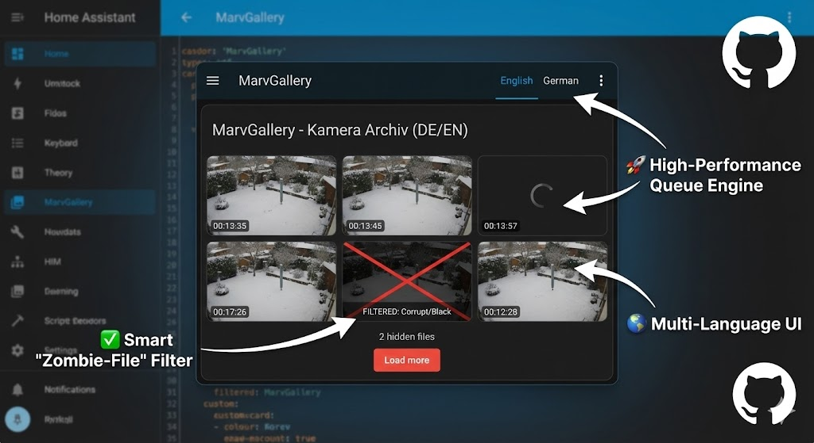

# MarvGallery 🖼️⚡

**Created by MrMarv89**

A high-performance, smart media gallery card for Home Assistant.
Built to handle large camera archives and specifically designed to **eliminate corrupt "Zombie" recording files** automatically.



## 🎯 The Problem it Solves

If you use surveillance cameras (like **Reolink**) with Home Assistant, you probably know the pain:
* **🧟 Zombie Files:** Cameras creating 0KB or 2KB MP4 files that contain valid headers but no video.
* **🌑 Black Screens:** Night recordings that are completely pitch black.
* **🐌 Slow Dashboards:** Browsers freezing when loading hundreds of thumbnails.

**MarvGallery fixes this.** It performs a visual analysis of every video in the background, proves it contains real footage, and filters out the trash.

## ✨ Key Features

* **Visual Seek Test:** Detects files that claim to be valid videos but contain no renderable frames (fixes the Reolink 2KB issue).
* **Darkness Filter:** Automatically hides recordings that are too dark (configurable threshold).
* **Parallel Queue Engine:** Loads thumbnails in a smart queue (2 at a time) to prevent browser crashes, even with thousands of files.
* **Smart Refill:** Automatically fills gaps in the grid when files are hidden.
* **Multi-Language:** Fully translated UI (English 🇬🇧 & German 🇩🇪).

## 📥 Installation

### Via HACS (Custom Repository)
1.  Go to HACS > Frontend.
2.  Click the 3 dots (top right) > **Custom repositories**.
3.  Add the URL of this repository (e.g., `https://github.com/MrMarv89/ha-marv-gallery`).
4.  Category: **Lovelace**.
5.  Click **Add** and install "MarvGallery".

### Manual Installation
1.  Download `marv-gallery.js`.
2.  Upload it to your `/www/` folder in Home Assistant.
3.  Add `/local/marv-gallery.js` to your dashboard resources.

## ⚙️ Configuration

### Basic Example
```yaml
type: custom:marv-gallery
title: "Garten Kamera"
startPath: "media-source://media_source/local/garden"
```

### 🛠️ Complete Configuration Reference
Here is a configuration containing **every available option**:

```yaml
type: custom:marv-gallery
title: "Kamera Archiv"
startPath: "media-source://media_source/local/"

# --- Layout & Grid ---
columns: 3                      # Number of columns
maximum_files: 10               # Initial items to show
itemSize: "120px"               # Minimum width of items
masonryMaxHeight: "400px"       # Max height of the card
title_align: "center"           # left, center, right
menu_position: "top"            # top, bottom, hidden

# --- Smart Filters ---
filter_broken: true             # Hides corrupt/empty video files (Recommended!)
filter_darkness_threshold: 10   # 0-255. Files darker than this are hidden.
                                # Set to 0 to keep dark night videos but still hide broken files.
show_hidden_count: true         # Shows "X hidden files" in the footer.

# --- Sorting & Parsing ---
parsed_date_sort: false         # Sort by date extracted from filename instead of file date
reverse_sort: false             # true = Newest first
file_name_date_begins: 0        # Index where the date starts in the filename
caption_format: "DD.MM HH:mm"   # Date format for the label

# --- Browsing & Updates ---
recursive: false                # Search in subfolders
enablePreview: true             # Show thumbnails
auto_refresh_interval: 10       # Seconds (0 = off)

# --- "Load More" Button Styling ---
load_more_count: 10             # How many items to add per click
load_more_label: "Mehr laden"   # Custom label text
load_more_color: "#ff0000"      # Background color (HEX/RGB)
load_more_text_color: "#ffffff" # Text color

# --- UI & Language ---
ui_language: "de"               # "en" (default) or "de"
showMenuButton: true            # Show the 3-dots menu button
ui_show_refresh_icon: true      # Show refresh icon in header
hide_refresh: false             # Hide specific menu items...
hide_sort: false
hide_load_more_menu: false
hide_home: false
```

### Option Details

| Option | Default | Description |
| :--- | :--- | :--- |
| `startPath` | **Required** | The media source path (e.g., `media-source://...`) |
| `ui_language` | `en` | User interface language (`en` or `de`). |
| `filter_broken` | `false` | Set to `true` to activate the smart zombie-file analysis. |
| `filter_darkness_threshold` | `10` | Brightness threshold (0-255). Set to `0` to disable darkness check. |
| `show_hidden_count` | `true` | Show a counter for filtered files in the footer/menu. |
| `masonryMaxHeight` | `400px` | Maximum height of the scrollable area. |
| `recursive` | `false` | If true, lists files from all subfolders flatly. |
| `parsed_date_sort` | `false` | Enable this if your filenames contain the date (e.g. `Cam_20230101.mp4`) and you want to sort by it. |

## ❤️ Credits
Developed by **MrMarv89**.

Based on concepts from the original Media Explorer Card, but rewritten for stability and smart filtering.
